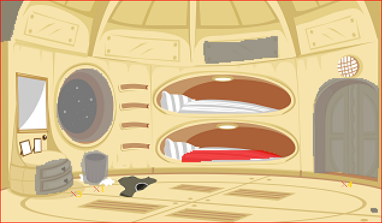
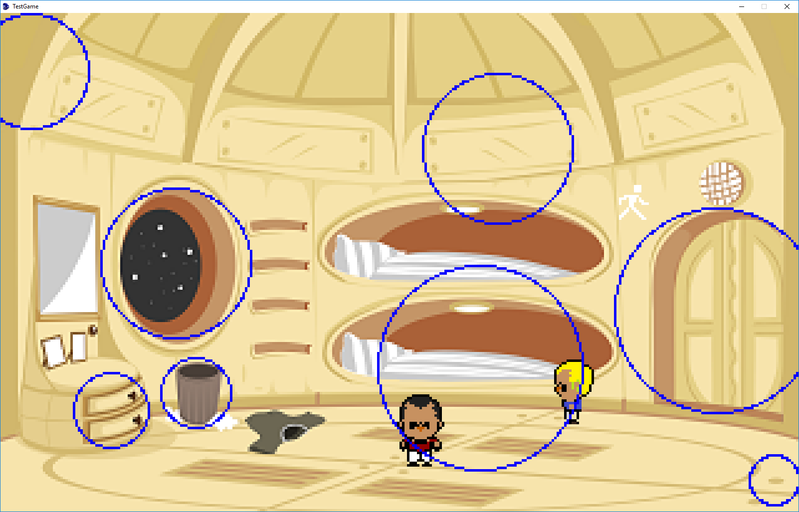
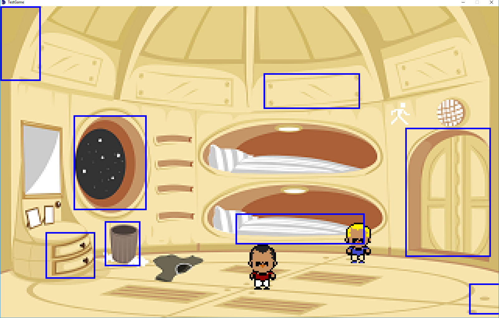

HintsHighlight Module
======================

This is a module for AGS ([Advanture Game Studio](http://www.adventuregamestudio.co.uk/)) engine. 

This module adds a hinting system to your game. Hints are circles or rectangles which highlight hotspots in the game. 

Players which are stuck and wish to skip the "pixel hunting" stage of a game, can press a button to display an overlay layer with all clickable hotspots highlighted by a shape.

### Example

